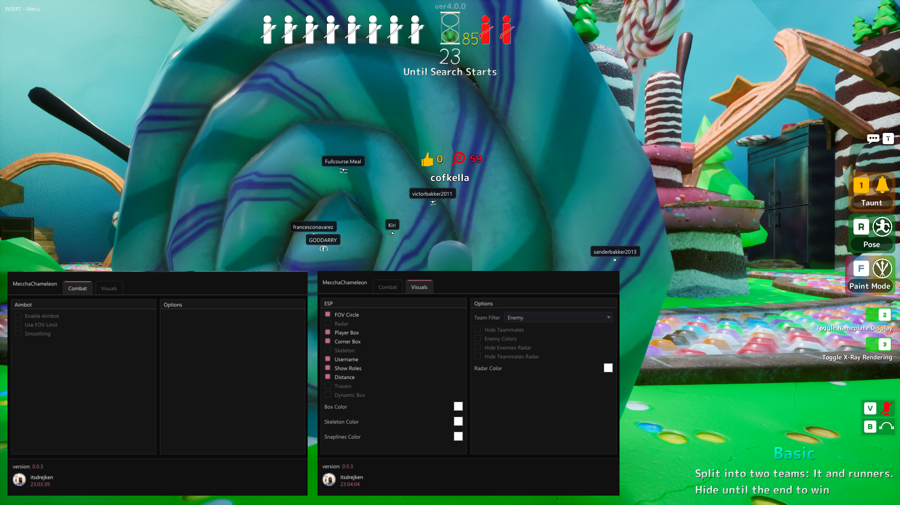

#  Maccha Chameleon Cheat Menu

A clean and lightweight cheat menu designed for **Maccha Chameleon**.

## 📸 Preview

## ✨ Features

| 🎯 AimBot | 👁️ Visuals | 🎨 Customization |
|---|---|---|
| ✅ FOV Limit | ✅ FOV Circle | 🎨 Box Color |
| ✅ Smoothing | ✅ Radar | 🦴 Skeleton Color |
| | ✅ Player Box | 📍 Snaplines Color |
| | ✅ Corner Box | |
| | ✅ Skeleton | |
| | ✅ Username | |
| | ✅ Show Roles | |
| | ✅ Distance | |
| | ✅ Traces | |
| | ✅ Dynamic Box | |

## ⚠️ Disclaimer

This project is provided for educational and research purposes. Use it responsibly and only in environments where you have permission to use or test it.

## 🛠️

The open-source version will be released soon, once I finish and polish the full version of this project.
